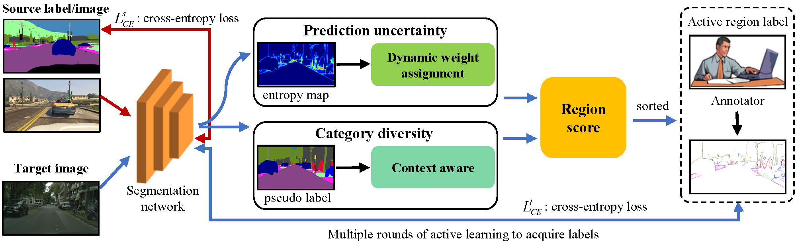

<div align="center"> 

# Dynamic Weight Assignment and Context-Aware Active Domain Adaptation for Semantic Segmentation
by [Licong Guan](https://licongguan.github.io/), Xue Yuan

</div>

This repository provides the official code for the paper "Dynamic Weight Assignment and Context-Aware Active Domain Adaptation for Semantic Segmentation"

> **Abstract** 
Active domain adaptation has been shown to maximize model performance at
a small label annotation cost. However, the existing research still leaves many
problems in exploring how to achieve the highest performance with the least cost.
To this end, this paper proposes a dynamic weight assignment and context-aware
active domain adaptation framework for semantic segmentation. First, the framework
adopts a region-based annotation mechanism, which can better trade-off annotation
budget and model performance than image-based and point-based annotation
mechanisms. Second, to address the poor performance of rare classes
caused by the long-tailed distribution of datasets, the framework assigns larger
prediction uncertainty scores to rare classes through a dynamic weight assignment
method to optimize rare class performance. Finally, the framework considers the
proximity of pixels in image space and uses context awareness to compute region
category diversity to more accurately select image regions most worthy of
annotation. Extensive experiments show that our method establishes state-of-theart
performance on GTAV ! Cityscapes, SYNTHIA ! Cityscapes two domain
adaptation tasks. With 5% labels annotated by the target domain, our method
achieves performance beyond fully supervised on the SYNTHIA ! Cityscapes
task.



## Usage

### Prerequisites
- Python 3.6.9
- Pytorch 1.8.1
- torchvision 0.9.1

Step-by-step installation

```bash
git clone https://github.com/licongguan/DWACA.git && cd DWACA
conda create -n DWACA python=3.6.9
conda activate DWACA
pip install -r requirements.txt
pip install torch==1.8.1+cu111 torchvision==0.9.1+cu111 -f https://download.pytorch.org/whl/torch_stable.html
```

### Data Preparation

- Download [The Cityscapes Dataset](https://www.cityscapes-dataset.com/), [The GTAV Dataset](https://download.visinf.tu-darmstadt.de/data/from_games/), and [The SYNTHIA Dataset](https://synthia-dataset.net/)

Symlink the required dataset

```bash
ln -s /path_to_cityscapes_dataset datasets/cityscapes
ln -s /path_to_gtav_dataset datasets/gtav
ln -s /path_to_synthia_dataset datasets/synthia
```

Generate the label static files for GTAV/SYNTHIA Datasets by running

```bash
python datasets/generate_gtav_label_info.py -d datasets/gtav -o datasets/gtav/
python datasets/generate_synthia_label_info.py -d datasets/synthia -o datasets/synthia/
```

### Install freeimage
```bash
# Download "imageio-binaries" into "/home/xxx/.imageio" and unzip
https://github.com/imageio/imageio-binaries/tree/master

```

The data folder should be structured as follows:

```
├── datasets/
│   ├── cityscapes/     
|   |   ├── gtFine/
|   |   ├── leftImg8bit/
│   ├── gtav/
|   |   ├── images/
|   |   ├── labels/
|   |   ├── gtav_label_info.p
│   └──	synthia
|   |   ├── RAND_CITYSCAPES/
|   |   ├── synthia_label_info.p
│   └──	
```

###  Model Zoo
#### GTAV to Cityscapes

We have put our model checkpoints here [[Google Drive](https://drive.google.com/drive/folders/1N-a5X1fWAhC2vdxZCgJ4tZ6iv2-gYI6v)] [[百度网盘](https://pan.baidu.com/s/1-QIgboVetaSSJbikiRmJXQ)] (提取码`0305`).

| Method                      | Net | budget | mIoU | Chekpoint | Where in Our Paper |
| --------------------------- | --------- | --------- | --------- | --------- | ----------- |
| DWACA                     | V3+     | 1.0%     | 69.8    | [Google Drive](https://drive.google.com/file/d/1HpntsgYKsRr_Mxeoew_7zdGJ4a33XquD/view?usp=drive_link)/[BaiDu](https://pan.baidu.com/s/1Won3krEJlKT5JLVMSq47ag)     | Figure 3 (a)    |
| DWACA                     | V3+     | 2.0%  | 71.3     | [Google Drive](https://drive.google.com/file/d/1zu9S4AGu0tBoDWj8EvzQSQMq69OYHvTM/view?usp=drive_link)/[BaiDu](https://pan.baidu.com/s/1O3-bzAV0RpGS7nKqqyMSOQ)     | Figure 3 (a)     |
| DWACA                     | V3+     | 3.0%  | 71.4     | [Google Drive](https://drive.google.com/file/d/1kXWLXbavJ8vCBJjOIZGghiijLUu3YZ4O/view?usp=drive_link)/[BaiDu](https://pan.baidu.com/s/1pkP9thdnX6xvgjlFKzwfMg)     | Figure 3 (a)     |
| DWACA                     | V3+     | 4.0%  | 71.7     | [Google Drive](https://drive.google.com/file/d/1k0X1jU-DZ_bZ5LBeBfwuFmNkBKASoLAy/view?usp=drive_link)/[BaiDu](https://pan.baidu.com/s/1-EAx3LAHhKQQm8epiflnKw)     | Figure 3 (a)     |
| DWACA                     | V3+     | 5.0%  | 71.9     | [Google Drive](https://drive.google.com/file/d/1Qtcxd45_bus-Oa9Aw894nhwwbfVIc9vs/view?usp=drive_link)/[BaiDu](https://pan.baidu.com/s/1zMo2wYJzWGSbZ3xrpcHjCg)     | Figure 3 (a)     |


#### SYNTHIA to Cityscapes
| Method                      | Net | budget | mIoU | Chekpoint | Where in Our Paper |
| --------------------------- | --------- | --------- | --------- | --------- | ----------- |
| DWACA                     | V3+     | 1.0%     | 71.5    | [Google Drive](https://drive.google.com/file/d/1WfFz7UzUViHIHAIzWRvYWYXfH9-v_2D7/view?usp=drive_link)/[BaiDu](https://pan.baidu.com/s/19XS1ypShdx4lkmNyCgQ17Q)     | Figure 3 (b)     |
| DWACA                     | V3+     | 2.0%  | 72.3     | [Google Drive](https://drive.google.com/file/d/1Pfpo8omqd2MTC7p0OZSmGmupWI8U9ccD/view?usp=drive_link)/[BaiDu](https://pan.baidu.com/s/1Pk23XBjszOThxI-ulKeJmw)     | Figure 3 (b)     |
| DWACA                     | V3+     | 3.0%  | 72.4     | [Google Drive](https://drive.google.com/file/d/1vpFaI87m6W_VnrBcWoy6WvIkqWkbtN3E/view?usp=drive_link)/[BaiDu](https://pan.baidu.com/s/1S4fx9aUEwhcSO0LqtqMXAg)     | Figure 3 (b)     |
| DWACA                     | V3+     | 4.0%  | 72.6     | [Google Drive](https://drive.google.com/file/d/1hTsCY4qtKN3X-RgTFa46z3D4yydEqLmw/view?usp=drive_link)/[BaiDu](https://pan.baidu.com/s/1la9RNgqufBE6acrgV2poww)     | Figure 3 (b)     |
| DWACA                     | V3+     | 5.0%  | 72.7     | [Google Drive](https://drive.google.com/file/d/169FkXO-ujc0FcfBfapvyeYAKZ7WgVyrr/view?usp=drive_link)/[BaiDu](https://pan.baidu.com/s/1EdJM0gcUsU1bmt2u86pUjQ)     | Figure 3 (b)     |

### DWACA Training

We provide the training scripts in `scripts/` using a single GPU.

```bash
# training for GTAV to Cityscapes
python train.py -cfg configs/gtav/deeplabv3plus_r101_RA_wt_5%.yaml OUTPUT_DIR results/v3plus_gtav_ra_wt_5.0_precent
```

### DWACA Testing
```bash
# To evaluate GTAV to Cityscapes (v3+, 5.0%)
sh eval.sh
```

## Acknowledgements
This project is based on the following open-source projects: [FADA](https://github.com/JDAI-CV/FADA) and [RIPU](https://github.com/BIT-DA/RIPU). We thank their authors for making the source code publically available.


## Contact

If you have any problem about our code, feel free to contact

- [lcguan941@bjtu.edu.cn](lcguan941@bjtu.edu.cn)

or describe your problem in Issues.